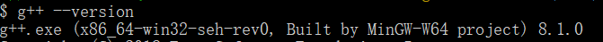

# 2021秋季学期数据结构Lab3

## 关于

项目开发环境为 Windows 10 ，因此对项目运行于 Linux 、 Mac OS 上出现的错误无法做出解答。

编译指令为 ```g++ -m64 -std=c++17 source.cpp```。

编译器版本信息：



另外，项目中已附带编译过的 ```Main``` 和 ```DataManager``` 。

使用方法：

```
Main.exe f1 f2 f3
```

```f1``` 为路径信息文件（二进制）

```f2``` 为输出文件

```f3``` 为询问文件（给定起点和终点）

```
DataManager.exe f1 f2
```

```f1``` 为路径信息文件（文本）

```f2``` 为输出文件（二进制）

项目中已附带 ```Start.py``` ，其运行环境为 ```Python 3.7``` 。

通过其代码可以辅助理解 ```Main``` 和 ```DataManager``` 的使用方法。

## 导航软件（最短路径算法的应用）

### 题目介绍和实验目的

要求在所给的数据集上建立图结构（邻接矩阵或者邻接表），并在建立的图结构上自行实现 Dijkstra 算法求解任意两点之间的最短路径。

实验目的：

帮助大家熟悉并掌握图的建立算法和 Dijkstra 求图上最短路径算法，了解 Dijkstra 算法的改进方法，掌握时间复杂度的分析方法并且去分析对比验证不同时间复杂度的 Dijkstra 算法的时间开销，了解稀疏的图结构的压缩存储方法。

输入输出要求：

Input：```Src```（源点） ```Dst```（目标点）

Output：

(1):最短路径的长度：```distance```

(2): ```Src``` 到 ```Dst``` 的一条最短路径，例如：```Src -> p1 -> p2 -> p3 -> ... -> Dst```（逆序输出路径也对）

### 数据集数据形式

数据集为 txt 文档，包含若干行数据，每行数据形式如下：

```src dst distance```

其中 ```src``` 表示源点， ```dst``` 表示目标点， ```distance``` 表示从源点到目标点有直接连接的路径且路径长度为 ```distance``` 

因为给出的 txt 文档十分巨大，每次执行程序后需要很长时间作 I/O ,

所以要求将 txt 文档预处理成为二进制文件，程序在执行时读取二进制文件到内存中构建图结构。

### 公开测试样例

见文件夹中 test_public.txt

### 评分细则

注（ $|V|$ 表示顶点数， $|E|$ 表示边数），已知在本次实验的数据集中， $|E|$ 和 $|V|$ 是同阶量。

 1. 正确实现朴素的 dijkstra 算法（时间复杂度为 $O(|V|^2)$ )且正确预处理数据为二进制文件并读入，并且通过助教验收时给出的测试样例，（ $75\%$ 的总分）
 1. 在 1 的基础上，成功将 dijkstra 算法的时间复杂度降低到 $O(|E|log(|V|)$ ）\[参考平均运行时间： $100s$ 之内\]，（ $4\%$ 的总分）
 2. 在 1 的基础上，成功将预处理的二进制文件的大小压缩为 $O(2|E|+|V|)$ 大小，（ $5\%$ 的总分）

 3. 在 2 的基础上略作改动，可以将 dijkstra 算法的时间复杂度又降低一个常数因子 \[参考平均运行时间： $25s$ 之内\]，（ $3\%$ 的总分）

 4. 自由发散部分（上限 $3\%$ 总分）：本实验鼓励你对 Dijkstra 算法做⼀些额外的探索与尝试，不设严格的限制，你可以根据自己的兴趣和 思考去自行选择方向和内容，不论做到什么程度，助教会综合根据思路、难度、工作量来打分。实验鼓励做大胆的、创新的尝试。

 5. 实验报告（ $10\%$ 总分）

### 注意事项

 - 给出的数据集规模比较大，同学们做实验的时候可以先用自己设计的一些小规模测试数据集去测试自己代码的正确性，待消除绝大多数 bug 后再在给出的数据集上运行导航程序，这样会节省大家的时间。

 - 关于 dijkstra 算法时间复杂度的降低，有很多种方法（基础提示：每次循环如何快速的选出拓展的点？），请大家去网上自行搜索资料并学习。

 - 本次实验验收时，并不仅仅只是看代码运行的结果，还要检查代码和设计思路，请同学们前来检查实验时整理好思路，能够对着代码讲出：某某代码段是做什么的，为什么要这么做，这么做是如何降低时间复杂度\如何降低存储空间开支（实现压缩存储）的？

 - 本次实验如果在完成中 1 的基础上又完成了 2 , 4 中的任意一项或者两项，都需要在执行结果中体现出对比，详细如下：

    输入：

    ```
    3523 248
    ```

    输出：

    ```

    最短路径长度：1231413

    最短路径为：3523 -> p1 -> p2 -> p3 -> ... -> 248 

    在朴素 dijkstra 算法的情形下：算法执行时间为： xxx s

    在改进 2 中：算法执行时间为： xxx s

    在改进 4 中：算法执行时间为：xxx s
    ```
        
    （Tips：如果平均运行时间直接达到了 $25s$ 之内，也可以不进行 2 的展示，只进行 1 ， 4 的对比展示）

 - :本次实验如果在完成 1 的基础上又完成了 3 ，则需要在检查时向助教展示两个文件：即一开始预处理的稍微大一点的二进制文件和改进后压缩存储的稍微小一点的二进制文件，并且展示代码中读取改进后二进制文件的部分。
